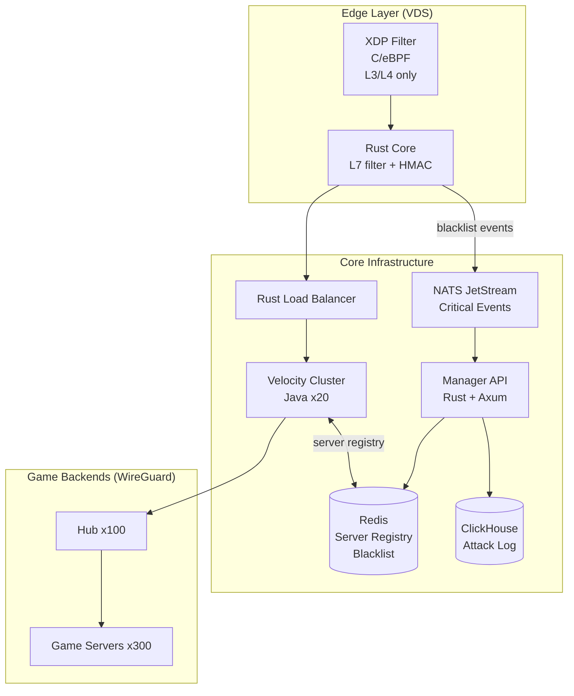

# Architecture - Rampart

> Актуально: v0.1+  
> Статус: основной документ

---

## Компоненты системы

```
┌─────────────────────────────────────────────────────────────────┐
│                        EDGE LAYER                               │
│  XDP/eBPF (C)  →  Rust Core  →  mTLS/QUIC → Manager           │
└─────────────────────────┬───────────────────────────────────────┘
                          │ чистый трафик
┌─────────────────────────▼───────────────────────────────────────┐
│                      PROXY LAYER                                │
│         Rust Load Balancer  →  Velocity Cluster (x20)          │
└─────────────────────────┬───────────────────────────────────────┘
                          │
        ┌─────────────────┼──────────────────┐
        ▼                 ▼                  ▼
   Hub (x100)      Game Servers        Game Servers
   лобби           Survival (x100)     Skyblock (x100)
                   разные VDS/дедики
```

## Типы нод и требования к хостингу

| Нода | Роль | CPU | RAM | Тип VDS | XDP нужен |
|---|---|---|---|---|---|
| **Edge** | Фильтрация DDoS | 2-4 vCPU | 2-4 GB | KVM / Bare Metal | ✅ |
| **Load Balancer** | L4 балансировка | 2 vCPU | 2 GB | KVM | ❌ |
| **Velocity** | MC Proxy | 4 vCPU | 4-8 GB | KVM | ❌ |
| **Manager** | API + Redis + NATS | 2-4 vCPU | 4-8 GB | KVM | ❌ |
| **Hub** | Лобби сервер | 4-8 vCPU | 8-16 GB | KVM / Bare Metal | ❌ |
| **Game Server** | Игровой процесс | 4-8 vCPU | 8-32 GB | KVM / Bare Metal | ❌ |

> ⚠️ **Важно:** XDP требует KVM или Bare Metal.  
> OpenVZ / LXC контейнеры - XDP не работает вообще.  
> Проверить тип виртуализации: `systemd-detect-virt`

## Sizing Guide

| Игроков онлайн | Edge нод | Velocity нод | Память Edge | Стоимость/мес (примерно) |
|---|---|---|---|---|
| до 500 | 1 | 2 | 2 GB | ~$15-30 |
| до 2 000 | 2 | 4 | 4 GB | ~$40-80 |
| до 10 000 | 4-6 | 8-10 | 8 GB | ~$150-300 |
| до 50 000 | 10-15 | 15-20 | 16 GB | ~$600-1200 |

> Цены ориентировочные для Hetzner/Contabo/Vultr. Bare Metal дешевле при большом трафике.

## Выбор WireGuard решения (для v0.1-v0.3)

**Используем hub-and-spoke + wg-quick.** Это просто, надёжно, понятно.

```
Manager нода = WireGuard Hub (10.0.0.1)
Все остальные ноды = Spoke, пиры с Hub
```

Headscale / Nebula / Tailscale - рассматриваем в v0.6+, когда нод станет 50+.

## Граница XDP / Rust (важно)

```
XDP делает:              Rust делает:
  L3: IP блэклист          L7: MC handshake парсинг
  L4: SYN flood drop        HMAC подпись hostname
  L4: rate limit (pps)      rate limit (connections/sec)
  L4: invalid TCP flags     блэклист (сложные правила)
  L4: UDP drop (MC=TCP)     bot challenge
                            GeoIP/ASN lookup
```

XDP **не делает** HMAC, SHA256, GeoIP lookup - нет floating point до kernel 6.x,  
нет доступа к heap, нет сложной логики. Всё L7 - только в Rust userspace.

## C4 - Container Diagram



## ADR-001: Rust для Edge Core

**Решение:** Rust + tokio  
**Альтернативы:** Go (GC паузы неприемлемы), C (небезопасен), Java (память)  
**Причина:** Zero-cost abstractions, memory safety, нет GC, интеграция с libbpf-rs

## ADR-002: Redis как хранилище состояния

**Решение:** Redis + локальный кэш на edge нодах  
**Оговорка:** При падении Redis - edge работает с кэшем блэклиста, Velocity с кэшем серверов  
**Масштаб:** Redis Cluster при 1000+ серверов, Redis Sentinel для HA

## ADR-003: NATS для критических событий

**Решение:** NATS JetStream для blacklist updates, attack events, audit log  
**Причина:** Redis Pub/Sub - fire-and-forget, NATS - at-least-once delivery  
**Redis Pub/Sub оставляем для:** server registry updates, global chat (потеря допустима)
